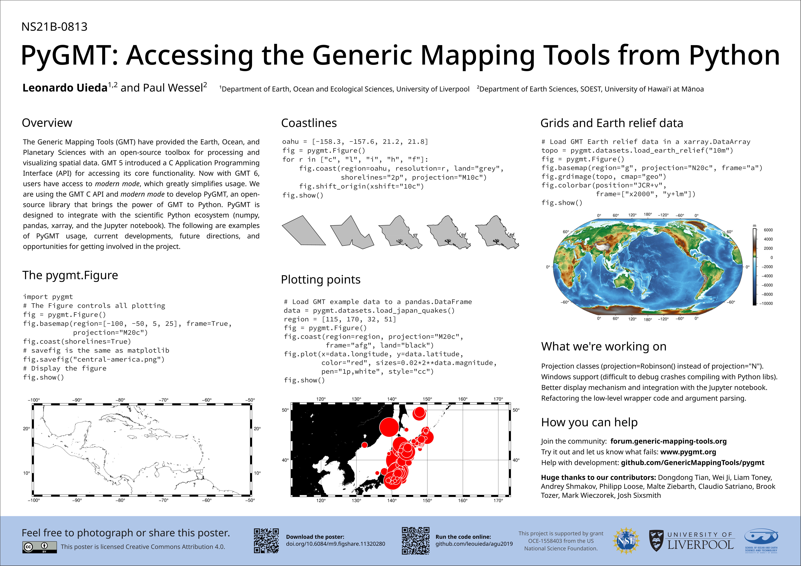

# PyGMT: Accessing the Generic Mapping Tools from Python

[Leonardo Uieda](https://leouieda.com/)1,2 and
[Paul Wessel](http://www.soest.hawaii.edu/wessel/)2

> 1Department of Earth, Ocean and Ecological Sciences, School of Environmental Sciences, University of Liverpool, UK 
> 2Department of Earth Sciences, SOEST, University of Hawai'i at Mānoa, USA 

Poster presented at the AGU 2019 Fall Meeting.

|    |Info|
|---:|:---|
|Session|[NS21B - A Tour of Open-Source Software Packages for the Geosciences](https://agu.confex.com/agu/fm19/meetingapp.cgi/Session/78079)|
|Abstract|[NS21B-0813](https://agu.confex.com/agu/fm19/meetingapp.cgi/Paper/571307)|
|When|Tuesday, 10 December 2019 / 8:00 - 12:20|
|Room|Moscone South - Poster Hall|
|Poster|doi:[10.6084/m9.figshare.11320280](https://doi.org/10.6084/m9.figshare.11320280)|
|Try the code|Run it on Binder: [agu2019.pygmt.org](http://agu2019.pygmt.org)|

## Abstract

For almost 30 years, the Generic Mapping Tools (GMT) have provided the Earth,
Ocean, and Planetary Sciences with an open-source toolbox for processing and
visualizing spatial data (bathymetry, gravity, magnetic, earthquake focal
mechanisms, and more). In many fields, GMT is the de facto standard for
creating high-resolution publication quality maps, figures, and animations.
Since version 5, GMT has provided a C language Application Programming
Interface (API) that allows other programs to access its core functionality. We
are using this bridge to develop PyGMT ([www.pygmt.org](http://www.pygmt.org/);
formerly GMT/Python), an open-source library that allows users of the Python
programming language to leverage the almost thirty years of continuous GMT
development. PyGMT is designed to integrate with the existing scientific Python
ecosystem, including popular packages such as numpy, pandas, and xarray. PyGMT
integrates seamlessly with the Jupyter notebook, allowing high-quality figures
to be generated interactively both in a personal computer and in cloud
computing environments compatible with Jupyter. We will present the design and
usage of the software package, latest developments and updates, and lessons
learned during its implementation.

## Notes

The poster was made entirely on Inkscape. The fonts are Noto Sans and Source
Code Pro.

## License

 
This content is licensed under a <a rel="license"
href="http://creativecommons.org/licenses/by/4.0/">Creative Commons Attribution
4.0 International License</a>.

The development of PyGMT was funded by
[NSF grant OCE-1558403](http://www.nsf.gov/awardsearch/showAward?AWD_ID=1558403).
